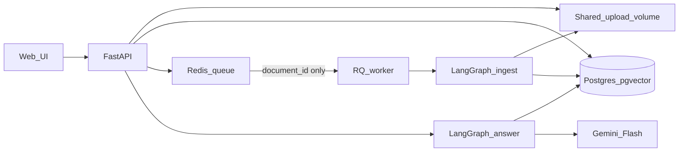
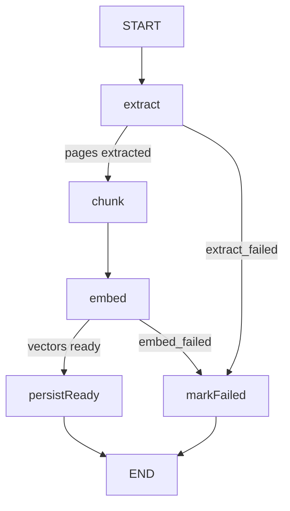
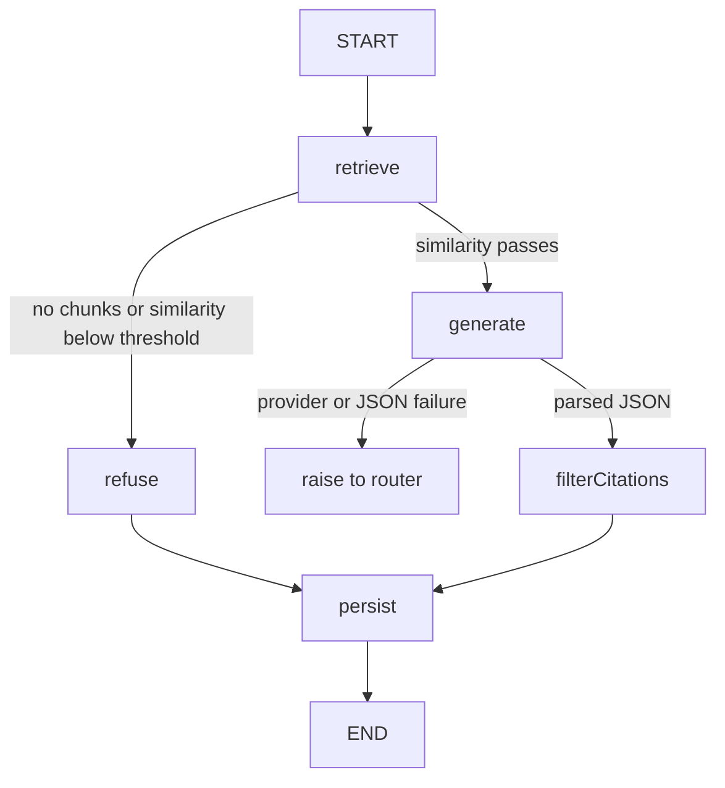

# DocuMind design

This file is the design. It is written before the feature code so the Git history shows the plan first.

DocuMind lets one employee upload policies, manuals, and onboarding guides, then ask a question in plain language. The answer comes only from that person's ready documents, and it names the document and the page. If the documents do not contain the answer, the system says so and cites nothing.

Later changes go at the bottom, under [What changed and why](#what-changed-and-why). This first version is not rewritten.

---

## Problem and model choice

### Business need

Employees waste time searching policies, manuals, and onboarding guides. They need a plain-language answer taken only from uploaded documents, with the exact source cited.

### Who uses it

- An employee who uploads documents and asks questions.
- A reviewer who signs up on the public link and checks citations and refusals.

Each person sees only their own documents and their own question history.

### What people do today

People search by filename or keyword, then read long PDFs by hand. When the question does not use the same words as the file, they ask a coworker. Nothing records which document and which page the answer came from.

### What hurts

- Keyword search misses the right passage.
- An answer cannot be checked, because there is no citation.
- A guessed answer is worse than saying the documents do not contain it.
- A public link could leak another user's files or drain model credits.

### What "done" looks like

- Upload a PDF or a text file and see a status: `queued`, `processing`, `ready`, or `failed`.
- Ask a question over all ready documents, or over a chosen set.
- Get an answer, citations (document name, passage, and page), and usage (tokens, latency, estimated cost).
- If the documents do not contain the answer, say so and cite nothing.
- Store question history. Deleting a document removes its chunks so it is never cited again.

### What the rules do, and what a model must do

Sign-up, ownership checks, upload, the queue, status, delete, the rate limit, and health do not need a model. A fixed rule cannot match a free-text question to the right passage and write a grounded answer. That part needs a model.

| Task | Needs a model? | How v1 does it |
|---|---|---|
| Intent | No | Every question means "answer from my documents." |
| Retrieval | Yes | Embed the question and the chunks, then search with pgvector. |
| Reasoning | Yes | The `generate` node decides whether the retrieved passages actually contain the answer. |
| Refusal | No separate model | A similarity cutoff, plus the answer model's own refusal. |
| Tool choice | No | The steps are a fixed LangGraph sequence. Nothing picks tools. |
| Writing the answer | Yes | The same `generate` node writes only from the retrieved passages and attaches citations. |

### Model requirements

- **Latency.** Answer in seconds. Store `latency_ms`. One retry on timeout, then a clear error.
- **Quality.** The right passage is retrieved, the answer matches that passage, and unanswerable questions are refused.
- **Context.** Send about 4 chunks (about 800 characters each), not the whole file.
- **Reasoning.** Enough to stay inside the passages and refuse. Deep multi-step reasoning is not required.
- **Cost.** A free-tier model, a rate limit so a public link cannot drain credits, and an estimated cost returned with the answer.
- **Privacy.** Embeddings run inside the app. Document text is not written to logs. One user cannot query another user's chunks.

### Which models, and why

| Candidate | Decision |
|---|---|
| Small classifier | Not used. There is no separate intent or label to predict. |
| Small fast LLM | Used for answers. Short context. Must follow "use only these passages." Gemini, called over HTTP only from the `generate` node. |
| Medium general model | Backup only. Switch only if the Phase 7 run shows the small model refuses too often or cites the wrong passage. |
| Large reasoning model | Skipped for v1. Higher cost and latency for a task that only needs a grounded answer. |
| Specialized embedding model | Used. `sentence-transformers/all-MiniLM-L6-v2`, run in the container, 384 dimensions, stored in Postgres with pgvector. |

The answer model id is `gemini-2.5-flash`. Published standard prices, used even when the free tier bills $0:

- Input text: **$0.30 per 1 million tokens**
- Output text, including thinking tokens: **$2.50 per 1 million tokens**

```text
estimated_cost_usd = (input_tokens * 0.30 + output_tokens * 2.50) / 1_000_000
```

Source: [Gemini API pricing](https://ai.google.dev/gemini-api/docs/pricing), checked 30 September 2026. Google Cloud lists a retirement date of 20 October 2026 for this model id. Before deploy, confirm the id still answers. If it does not, switch to the current Flash model, keep the same HTTP call, and record the new id and prices under "What changed and why".

On the `refuse` path, tokens are 0 and cost is 0, because Gemini is not called.

Phase 7 changes one variable (chunk size, number of chunks, embedding model, or prompt) and compares it to this baseline. The baseline stays MiniLM plus Gemini until that comparison is written in `EVALUATION.md`.

The check set is at least 15 questions on public documents, including at least 5 the documents cannot answer. The script reports accuracy, average latency, cost, retrieval hit rate, correct refusal rate, and whether each citation is a passage that was actually retrieved.

### What the user opens

One web page, served by the API: sign up, log in, upload, watch status, ask a question, see citations or "not found." No mobile app in v1.

---

## Requirements

These are the parts the brief asks for, and what this design builds for each one.

### Part A — backend

- **A1 Authentication.** Sign up and log in with a username or email and a password. Store only a hash. An access token is required on every document route and every question route. Every query uses the user id inside the token. Another user's id returns 404, including a guessed id.
- **A2 Documents.** Upload PDF and plain text or Markdown. Cap the upload at 10 MB while the body is still streaming. `POST /documents` returns `202` immediately. A worker extracts, chunks, and embeds. Status is `queued`, `processing`, `ready`, or `failed` with a short reason. List and delete. Delete removes the file and the chunks.
- **A3 Questions.** `POST /questions` takes a question and an optional list of document ids. An empty list means every ready document owned by the caller. The response has the answer, citations, usage, and a `refused` flag. `GET /questions` is this user's history only.
- **A4 Robustness.** At most 10 questions per user per minute. One retry with backoff when Gemini returns 429 or 5xx, then a clear 503. Do not return the provider body. `/health` reports the database, the vector extension, Redis, and the worker. Logs are JSON and carry a request id. Logs never contain document text, passwords, tokens, or the Gemini key.
- **A5 Interface.** One page served by the API. Swagger stays at `GET /docs`.

### Part B — answers grounded in documents

- Chunk about 800 characters with 120 characters of overlap. Each chunk stores the document name, the page, and the chunk index.
- Embeddings are MiniLM inside the container. The vector store is Postgres 16 with pgvector. Search is semantic. The prompt never receives a whole document.
- Retrieval keeps `user_id` from the token and `status = ready`. If the caller passed document ids, those ids are checked for ownership first. The query returns at most 4 chunks.
- Two gates stop a bad answer. If nothing is retrieved, or the best similarity is below the threshold, a fixed sentence is returned and Gemini is not called. If the passages are related but miss the fact, the model may still refuse. A citation is kept only when its chunk id was in the set retrieved for this request.
- Uploaded text is data. Passages go in the user message, never in the system prompt. `eval/fixtures/prompt-injection.md` tries to override that. The eval records that the system does not follow it. This stays a residual risk.

### Part C — ship it

- Two images: API and worker. Non-root user. No secrets in the image. MiniLM weights are downloaded at build time.
- `docker compose up` starts the API, the worker, Postgres, and Redis.
- GitHub Actions lints, runs tests with Gemini mocked, and builds both images.
- The live host runs the same four processes over HTTPS. Config comes from environment variables.

### Part D and Part E — how the work is shown

- This file is committed before feature code.
- At least six GitHub Issues on the fork, and feature branches merged through pull requests.
- Tests cover chunking, password hashing, cross-user access, and one full question with Gemini mocked.
- The final commit is tagged `v1.0.0`.
- The submission README, `EVALUATION.md`, `AI_USAGE.md`, the resume, and a demo video come after the live core works.

### Not in v1

These stay out until the live link works, and most of them stay out after that unless an eval shows they are needed:

- Streaming answers
- Hybrid keyword plus vector search
- A reranker
- Conversation memory and follow-up questions
- Caching repeated questions
- Continuous deployment
- A LangChain agent, a retrieval chain, LangSmith, a LangGraph checkpointer, Kubernetes, or a separate vector database
- A third container for the UI
- A mobile app
- A refresh token

---

## Assumptions

No email was sent to the assignment contact. These choices are fixed so building can start.

- **Access token only.** There is no refresh token. `exp` is 24 hours after login (`expires_in` is `86400`). When it expires, the user logs in again.
- **Login field.** `POST /auth/login` takes `username` and `password`. `username` may be the username or the email. A wrong password and an unknown user return the same 401 message.
- **Password length.** A password must be at least 8 characters. The hash is argon2. The plaintext is never stored and never logged.
- **Upload cap.** 10 MB, checked while streaming. The server does not buffer an unbounded body.
- **Allowed files.** PDF (`application/pdf` or bytes starting with `%PDF`) and plain text or Markdown that decodes as UTF-8. Anything else is 415.
- **Chunks.** 800 characters, overlap 120. Top-k is 4.
- **Similarity gate.** `SIMILARITY_THRESHOLD` starts at `0.35`. That number is a placeholder. Phase 7 sets the real value: high enough to refuse unanswerable questions, low enough to keep answerable ones. Below the threshold, the LLM is not called.
- **Not-found sentence.** `I could not find this in your documents.`
- **Queue payload.** Redis receives the document id string only. File bytes stay on the shared upload volume at `{UPLOAD_DIR}/{document_id}`.
- **Stuck jobs.** A document left in `processing` for more than 10 minutes is set back to `queued` and enqueued again. Re-running is safe because the ready step replaces that document's chunks in one transaction.
- **Rate limit.** 10 questions per user per minute, Redis key `rl:{user_id}:{current_minute}`. Upload and status polling are not limited.
- **Gemini timeout.** About 20 seconds. One retry with backoff on HTTP 429 or 5xx. Then 503. The provider body is not returned to the client.
- **Shared disk.** Compose mounts one volume at the same path on the API and the worker. If the live host cannot share a disk, file bytes are stored in Postgres under the document id. That choice is written here before deploy. Object storage is a later step.
- **Errors.** JSON is `{"detail": "..."}`, which is FastAPI's default shape. A missing or foreign document is 404, never 403, so the response does not reveal that the id exists.
- **Tests.** Pytest uses Postgres when `DATABASE_URL` points at a test database, so the vector column matches production. Gemini HTTP is mocked. CI does not have an API key.

---

## Architecture

The API saves the file and enqueues a document id. The worker runs the ingest graph. `POST /questions` checks the token, ownership, and the rate limit, then runs the answer graph once. Gemini is called only from the `generate` node.



### Ingest graph

The worker job `ingest(document_id)` loads the row, sets `processing`, then calls `app.graphs.ingest.graph.invoke({"document_id": document_id})`. There is no checkpointer. The state exists only for that one call.



- `extract` reads `{UPLOAD_DIR}/{document_id}`. A PDF becomes `{page, text}` pages. A text file is one page, page number `1`. Failure sets `error=extract_failed`.
- `chunk` cuts 800-character windows with 120 overlap. Each piece keeps the document name, page, chunk index, content, user id, and document id.
- `embed` uses MiniLM, loaded once per process. Each vector has length 384. Failure sets `error=embed_failed`.
- `persistReady` is one transaction: delete old chunks for that document, insert the new ones, set `status=ready`, clear `error`, then commit. The status is not `ready` until that commit.
- `markFailed` sets `status=failed` and the short reason already on the state. It does not store a traceback that could contain file text.

### Answer graph

The router does auth, ownership, and the rate limit. Then it calls `app.graphs.answer.graph.invoke(...)` once. The graph is compiled at import time. No checkpointer.



- `retrieve` embeds the question with the same MiniLM model and runs one SQL query: this user's chunks, joined to documents with `status = ready`, optional document id list, ordered by cosine distance, limit 4.
- `refuse` does not call Gemini. It sets the fixed not-found sentence, empty citations, and `refused=true`.
- `generate` calls Gemini over HTTP. The system prompt says: answer only from the passages, return JSON `{"answer", "chunk_ids", "refused"}`. The user message holds the question and a delimited block of passages. Each passage is labeled with its chunk id. If the JSON cannot be parsed, the node raises. The router turns that into 503. It does not invent an answer.
- `filterCitations` keeps a citation only when its chunk id was retrieved for this request.
- `persist` inserts the `questions` row and leaves that row on the state. The router maps the state to the HTTP body. The router does not call Gemini.

LangGraph state is not a database table. It lives for one `invoke`. The `questions` row is the record that remains.

---

## API contract

The base path is the API origin. Protected routes need `Authorization: Bearer <access_token>`. Times are ISO-8601 UTC. Ids are UUID strings.

### `POST /auth/signup`

No token.

Request:

```json
{"username": "ada", "email": "ada@example.com", "password": "at-least-8"}
```

`201` response. The password is not returned.

```json
{"id": "uuid", "username": "ada", "email": "ada@example.com"}
```

| Status | When |
|---|---|
| 201 | User created |
| 409 | Username or email already exists |
| 422 | Missing field, bad email, or password shorter than 8 characters |

### `POST /auth/login`

No token.

Request. `username` may be the username or the email.

```json
{"username": "ada", "password": "at-least-8"}
```

`200`:

```json
{"access_token": "jwt", "token_type": "bearer", "expires_in": 86400}
```

| Status | When |
|---|---|
| 200 | Password matches |
| 401 | Unknown user or wrong password. Same message: `Incorrect username or password.` |
| 422 | Missing field |

The token payload is `sub` (user id) and `exp` (now plus 24 hours), signed with `JWT_SECRET`.

### `POST /documents`

Token required. Body is multipart form data with one file field named `file`.

`202`:

```json
{"id": "uuid", "status": "queued"}
```

| Status | When |
|---|---|
| 202 | Row inserted, file saved, document id enqueued |
| 401 | Missing or bad token |
| 413 | File larger than 10 MB |
| 415 | Not a PDF and not valid UTF-8 text |
| 422 | No file field |

The request does not extract, chunk, or embed.

### `GET /documents`

Token required. Returns only the caller's documents, newest first.

`200`:

```json
[
  {
    "id": "uuid",
    "filename": "handbook.pdf",
    "media_type": "application/pdf",
    "status": "ready",
    "error": null,
    "byte_size": 12000,
    "created_at": "2026-09-30T12:00:00Z"
  }
]
```

`status` is `queued`, `processing`, `ready`, or `failed`. `error` is null, `extract_failed`, or `embed_failed`.

| Status | When |
|---|---|
| 200 | List, which may be empty |
| 401 | Missing or bad token |

### `GET /documents/{document_id}`

Token required. Uses the shared ownership helper: the row is returned only when `user_id` matches the token and the id matches. Otherwise 404.

`200` is one object with the same fields as a list item.

| Status | When |
|---|---|
| 200 | Caller owns this document |
| 401 | Missing or bad token |
| 404 | Missing id, or the id belongs to someone else |

### `DELETE /documents/{document_id}`

Token required. Same ownership helper. Deletes the file and the row. `ON DELETE CASCADE` removes chunks.

`204` with an empty body.

| Status | When |
|---|---|
| 204 | Deleted |
| 401 | Missing or bad token |
| 404 | Missing id, or the id belongs to someone else |

### `POST /questions`

Token required. Rate limit runs before the answer graph.

Request. Omit `document_ids`, or send `[]`, to search every ready document the caller owns.

```json
{"question": "How many days of leave?", "document_ids": ["uuid"]}
```

`200`:

```json
{
  "id": "uuid",
  "answer": "string",
  "citations": [
    {"document_name": "handbook.pdf", "passage": "string", "page": 1}
  ],
  "usage": {"tokens": 0, "latency_ms": 0, "estimated_cost_usd": 0.0},
  "refused": false
}
```

A refusal is still `200`. `refused` is `true`, `citations` is `[]`, `tokens` is `0`, and `answer` is `I could not find this in your documents.`

| Status | When |
|---|---|
| 200 | Answer or refusal saved |
| 401 | Missing or bad token |
| 404 | Any supplied document id is missing or belongs to someone else. The graph is not called. |
| 422 | Empty question, or a document id that is not a UUID |
| 429 | More than 10 questions for this user in the current minute |
| 503 | Gemini timed out, returned 429 or 5xx after one retry, or returned JSON that could not be parsed |

### `GET /questions`

Token required. This user's rows only, newest first. This route does not run the graph.

`200`:

```json
[
  {
    "id": "uuid",
    "question": "How many days of leave?",
    "answer": "string",
    "citations": [{"document_name": "handbook.pdf", "passage": "string", "page": 1}],
    "document_ids": ["uuid"],
    "usage": {"tokens": 0, "latency_ms": 0, "estimated_cost_usd": 0.0},
    "refused": false,
    "created_at": "2026-09-30T12:00:00Z"
  }
]
```

| Status | When |
|---|---|
| 200 | List, which may be empty |
| 401 | Missing or bad token |

### Health

No token. These routes do not return connection strings.

`GET /health/live` is the restart probe. `200`:

```json
{"status": "ok"}
```

`GET /health` and `GET /health/ready` check the same things: Postgres answers `SELECT 1`, the `vector` extension exists, Redis answers `PING`, and the worker heartbeat key `worker:heartbeat` is present. The oldest `queued` document must not be older than the 10-minute sweep timeout.

`200` when every check passes:

```json
{
  "status": "ok",
  "checks": {"database": "ok", "vector": "ok", "redis": "ok", "worker": "ok"}
}
```

`503` when any check fails. The failed check is named. Example:

```json
{
  "status": "down",
  "checks": {"database": "ok", "vector": "ok", "redis": "ok", "worker": "down"}
}
```

### Pages the API also serves

| Route | What it is |
|---|---|
| `GET /` | The one-page UI, `ui/index.html` |
| `GET /docs` | Swagger, provided by FastAPI |

---

## Data model

Four tables. Postgres 16. `CREATE EXTENSION IF NOT EXISTS vector` runs before the tables are created.

### `users`

| Column | Type | Notes |
|---|---|---|
| `id` | uuid | Primary key |
| `username` | text | Unique |
| `email` | text | Unique |
| `password_hash` | text | Argon2 hash, never the plaintext |
| `created_at` | timestamptz | Set on insert |

### `documents`

| Column | Type | Notes |
|---|---|---|
| `id` | uuid | Primary key. Also the file name on disk and the queue message |
| `user_id` | uuid | Foreign key to `users.id` |
| `filename` | text | Original file name, used in citations |
| `media_type` | text | For example `application/pdf` or `text/plain` |
| `storage_key` | text | Same as the document id |
| `status` | text | `queued`, `processing`, `ready`, or `failed` |
| `error` | text, nullable | Short reason: `extract_failed` or `embed_failed` |
| `byte_size` | integer | Size after the 10 MB check |
| `attempt_count` | integer | Incremented each time the worker starts |
| `processing_started_at` | timestamptz, nullable | Used by the stuck-job sweep |
| `created_at` | timestamptz | Set on insert |

### `chunks`

| Column | Type | Notes |
|---|---|---|
| `id` | uuid | Primary key. This is the id the model may cite |
| `document_id` | uuid | Foreign key to `documents.id`, `ON DELETE CASCADE` |
| `user_id` | uuid | Copied from the document so retrieval can filter without a join on users |
| `document_name` | text | Copied so a citation does not need another lookup |
| `page` | integer | Page number. Text files use `1` |
| `chunk_index` | integer | Order inside the document |
| `content` | text | The passage |
| `embedding` | `vector(384)` | MiniLM vector |

Index the embedding for cosine distance, and index `(user_id, document_id)`. Retrieval joins `documents` and keeps `status = ready`.

### `questions`

| Column | Type | Notes |
|---|---|---|
| `id` | uuid | Primary key |
| `user_id` | uuid | Foreign key to `users.id` |
| `question` | text | The user's question |
| `answer` | text | The grounded answer, or the not-found sentence |
| `refused` | boolean | True when the gate or the model refused |
| `citations` | jsonb | List of `{document_name, passage, page}` |
| `document_ids` | uuid array | The scope used for this question |
| `tokens` | integer | Input plus output. `0` on the refuse path |
| `latency_ms` | integer | Time for this question |
| `estimated_cost` | numeric | Dollars, from the formula above |
| `created_at` | timestamptz | Set on insert |

LangGraph state is not a fifth table.

---

## Trade-offs

**LangGraph instead of one straight function.** Ingest and answering are fixed sequences with branches: extract can fail, similarity can refuse, Gemini can fail. A `StateGraph` makes those branches visible. A reviewer can open the graph and see which node runs next. The nodes stay plain Python functions in `app/services/`, so a live review can change one step without untangling a framework.

**No agent and no checkpointer.** The steps do not change from question to question. An agent that picks tools would hide the path. A checkpointer would store conversation memory, which v1 does not have. Each question is one `invoke`. History is the `questions` table.

**Postgres plus pgvector, not a separate vector database.** Users, documents, chunks, and vectors live in one database. Deleting a document cascades its chunks, so a deleted file cannot be cited. One service is easier to run than Postgres plus Qdrant or Chroma. FAISS is not a durable store for many users.

**Redis plus RQ.** The upload request must return before extract, chunk, and embed. RQ carries the document id to a second process. The same Redis counts questions per user per minute and stores the worker heartbeat. The file bytes are not put on the queue, so a large PDF is not copied through Redis.

**MiniLM inside the image.** The image is larger, and the build downloads the weights. Ingestion then does not depend on an embedding API quota or an extra key. The same model embeds documents and questions, so the vectors match.

**Gemini over HTTP from the `generate` node.** `httpx` keeps the call visible: timeout, one retry, token counts, then a parsed JSON object. The graph does not wrap Gemini in a chat-model library. The router never calls Gemini. The `refuse` node never calls it either.

**The UI is a file the API serves.** The brief asks for a frontend image only when the frontend is a separate service. One HTML page is enough to sign up, upload, poll status, and read a citation. Two images, not three.

**The queue message is only the document id.** The API and the worker share the upload volume, so both can open `{UPLOAD_DIR}/{document_id}`. The queue stays small. If the worker crashes, the sweep requeues the id and the graph replaces chunks for that id. It does not append a second copy.

---

## Locked stack

- Python 3.12 and FastAPI for the API, the worker, chunking, retrieval, and the eval script.
- LangGraph `StateGraph` for `ingest` and `answer`. Nodes are plain functions. No agent, no retrieval chain, no checkpointer.
- Postgres 16 and pgvector.
- Redis and RQ for the queue, the question rate limit, and the worker heartbeat.
- Local embeddings: `sentence-transformers/all-MiniLM-L6-v2`, 384 dimensions.
- Answers: `gemini-2.5-flash` over HTTP from the `generate` node.
- UI served by the API. Docker images: API and worker only.

---

## What changed and why

The evaluation runs in LangSmith. `eval/run_eval.py` still calls the same ingest graph and the same answer graph. LangSmith stores the dataset and the experiment, and the script prints retrieval hit rate, answer correctness, correct refusal rate, false refusal rate, and average latency. A second run changes only the chunk window (`--chunk-size`). The app does not depend on LangSmith. Tracing is on only for that script.
